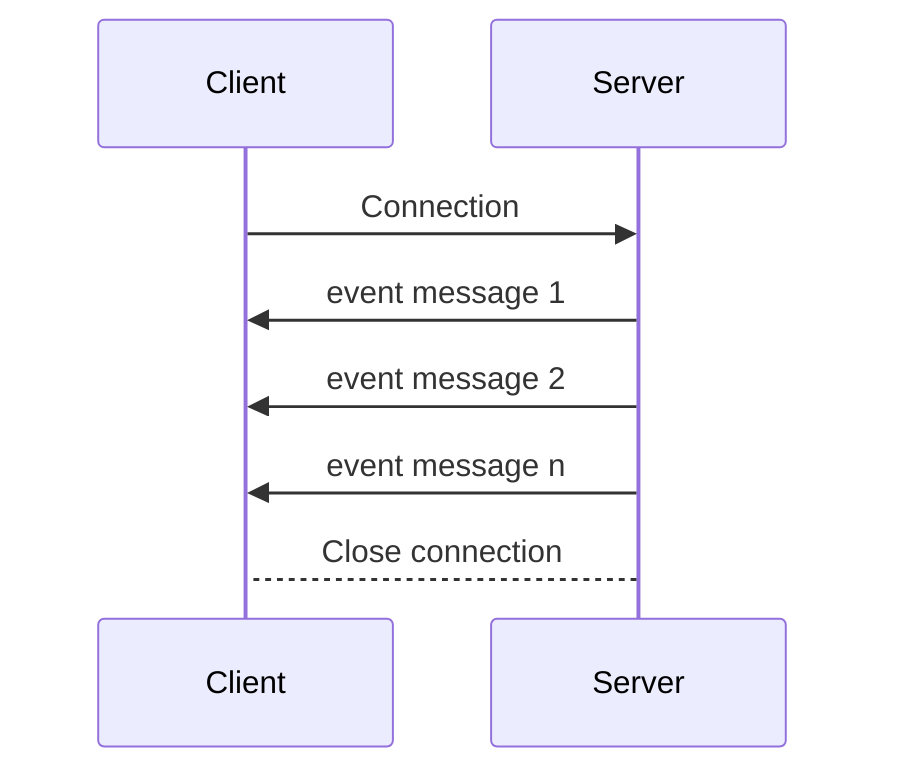

# Go Server-Sent Events basic example with channels

A minimal basic [SSE](https://en.wikipedia.org/wiki/Server-sent_events) implementation example in [Golang](https://go.dev/)

## Features

* Go channels and goroutines
* SSE HTTP server
* JavaScript client with HTML and CSS static files served
* Connect/Disconnect buttons
